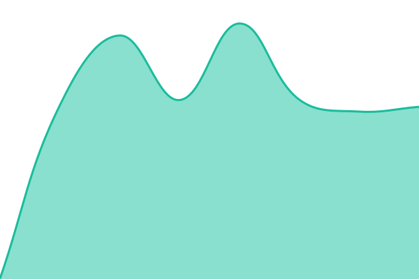
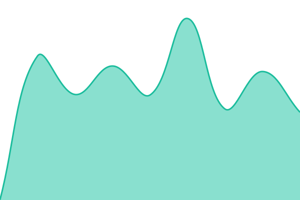
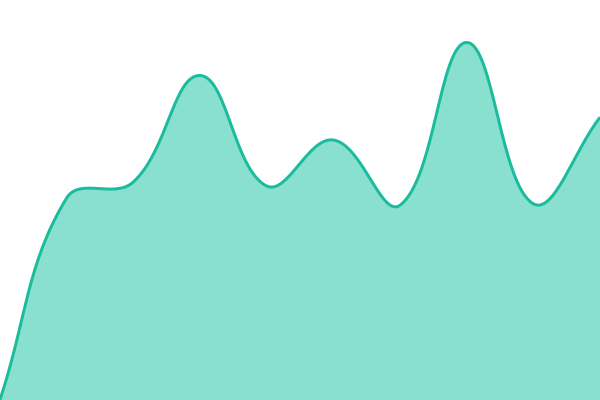

# [📈 Live Status](https://status.aibuku.com): <!--live status--> **🟩 All systems operational**

This repository contains the open-source uptime monitor and status page for [klevox context](https://status.aibuku.com), powered by [Upptime](https://github.com/upptime/upptime).

With [Upptime](https://upptime.js.org), you can get your own unlimited and free uptime monitor and status page, powered entirely by a GitHub repository. We use [Issues](https://github.com/klevox-context/status/issues) as incident reports, [Actions](https://github.com/klevox-context/status/actions) as uptime monitors, and [Pages](https://status.aibuku.com) for the status page.

<!--start: status pages-->
<!-- This summary is generated by Upptime (https://github.com/upptime/upptime) -->
<!-- Do not edit this manually, your changes will be overwritten -->
<!-- prettier-ignore -->
| URL | Status | History | Response Time | Uptime |
| --- | ------ | ------- | ------------- | ------ |
|  [API](https://api.aibuku.com/v1/health) | 🟩 Up | [api.yml](https://github.com/klevox-context/status/commits/HEAD/history/api.yml) | 

 530ms
     
 | 

<a href="https://status.aibuku.com/history/api">100.00%</a>
    

|  [Broker (auth)](https://auth.aibuku.com/health) | 🟩 Up | [broker-auth.yml](https://github.com/klevox-context/status/commits/HEAD/history/broker-auth.yml) | 

 497ms
     
 | 

<a href="https://status.aibuku.com/history/broker-auth">100.00%</a>
    

|  [MCP Gateway](https://mcp.aibuku.com/health) | 🟩 Up | [mcp-gateway.yml](https://github.com/klevox-context/status/commits/HEAD/history/mcp-gateway.yml) | 

 554ms
     
 | 

<a href="https://status.aibuku.com/history/mcp-gateway">100.00%</a>
    

|  [Portal (app)](https://app.aibuku.com/) | 🟩 Up | [portal-app.yml](https://github.com/klevox-context/status/commits/HEAD/history/portal-app.yml) | 

 1088ms
     
 | 

<a href="https://status.aibuku.com/history/portal-app">100.00%</a>
    

<!--end: status pages-->

[**Visit our status website →**](https://status.aibuku.com)

## 📄 License

- Powered by: [Upptime](https://github.com/upptime/upptime)
- Code: [MIT](./LICENSE) © [Anand Chowdhary](https://anandchowdhary.com)
- Data in the `./history` directory: [Open Database License](https://opendatacommons.org/licenses/odbl/1-0/)
